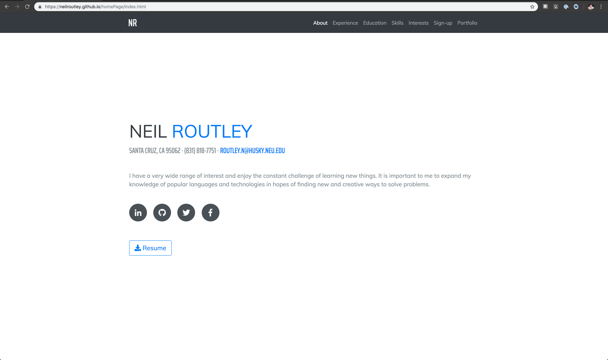

# Homepage
Neil Routley's personal Homepage includes the following:
- About
- Experience
- Education
- Skills
- Interests
- Portfolio

## Objective
The objective of this CS5610 class project is to create a personal portfolio website for showing off projects. It required the use of Bootstrap4+ and some vanilla JavaScript.

## Preview



## Tech
This webpage includes the following technologies:

* HTML5
* CSS3
* Font Awesome
* Bootstrap
* JavaScript
* jQuery


## Installation
```sh
$ git clone git@github.com:neilroutley/homePage.git
$ cd homePage
$ open index.html (alt: run reload/http-server)
```


## Links
- [Website](https://neilroutley.com)
- [Demo Video](https://www.youtube.com/watch?v=eTffFcDAizA&feature=youtu.be)
- [Slides](https://docs.google.com/presentation/d/18qnaEKQv-kSD2iBQMQuZlf1H8NPNmZOgmV8cgIPBTrs/edit?usp=sharing)
- [CS5610 Website](http://johnguerra.co/classes/webDevelopment_spring_2019/)


## License
This project is licensed under the MIT License - please see the [LICENSE](LICENSE)
